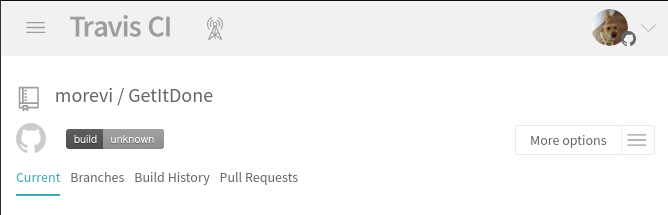
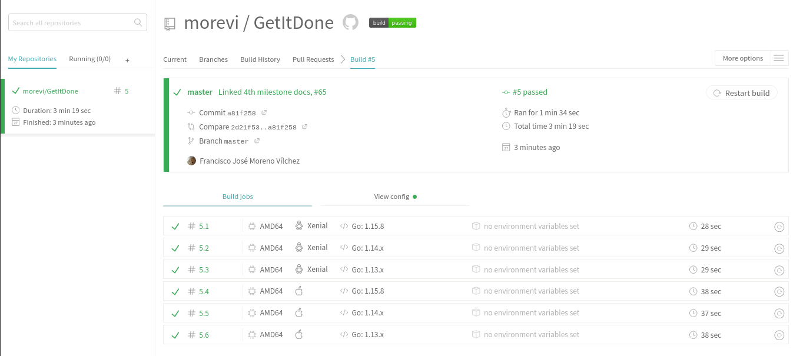

# Tema de Integración Continua.

## Registrarse en un sistema de CI, enlazarlo con nuestro repositorio, y crear un fichero de configuración.

Creado un [fichero de configuración](https://github.com/morevi/GetItDone/blob/master/.travis.yml), que permite testear el proyecto en diferentes versiones del lenguaje y sobre Linux y OSX. 

## Configurar CI usando Travis u otro sitio
Podemos ver log que indica que se ejecutan y pasan los tests:

