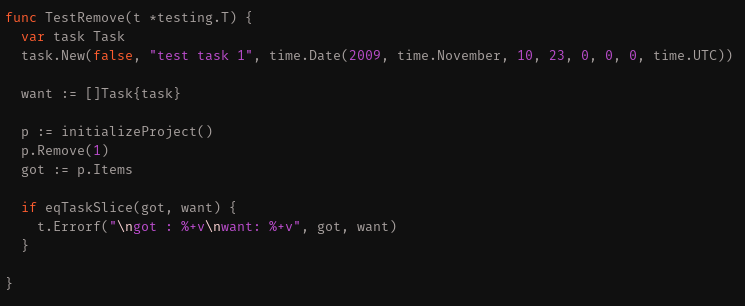
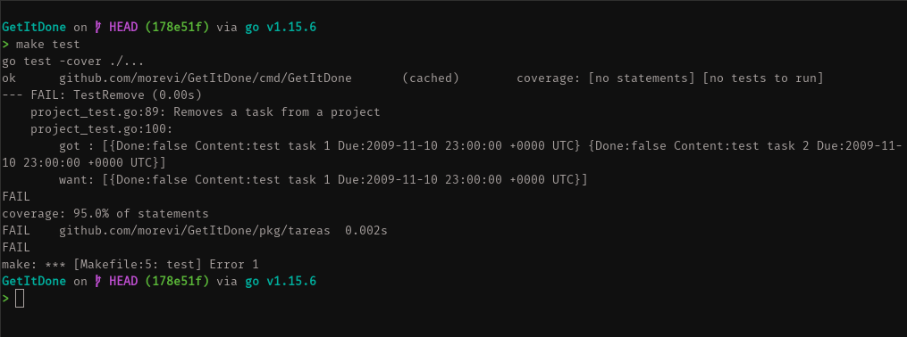
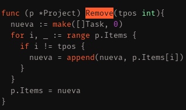
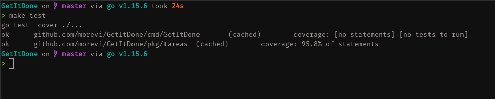

# Tema 2. Desarrollo basado en pruebas.

## Ejercicio 2.
Primero escribimos el test de Project.Remove()

Vemos que falla, y que no borra. El objeto test esta inicializado con 2 Task, sin embargo no se borra ninguna.

Escribimos la el método.

Y ahora pasan los test.

