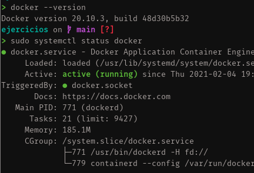
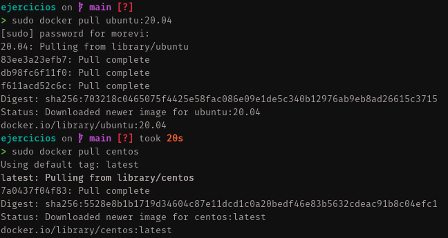
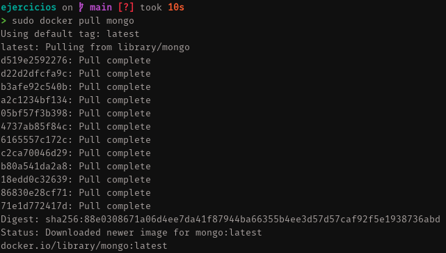
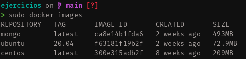
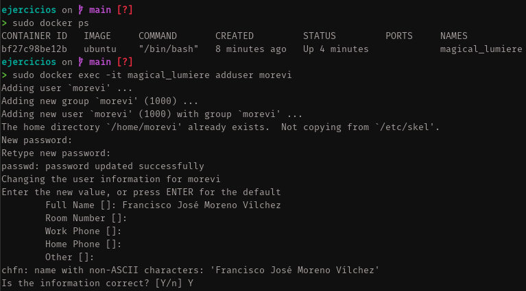
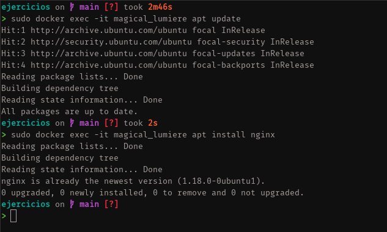
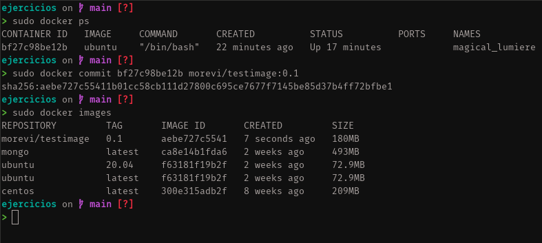
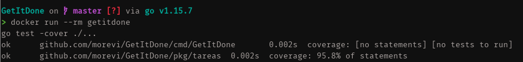
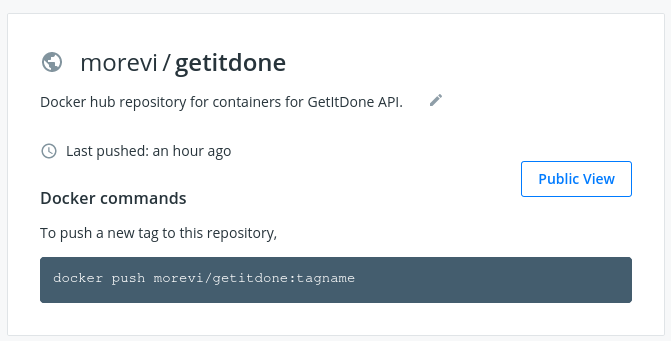

# Contenedores
## 1. Instalar docker


## 2. Instalar imágenes de Ubuntu, CentOS y MongoDB




## 3. Crear un usuario e instalar NGINX en un contenedor



## 4. Hacer un commit del contenedor anterior


## 5. Crear un Dockerfile que testee una clase
El Dockerfile quedará así:
```golang
FROM golang:1.15.7-alpine
LABEL version = "1.0" maintainer = "Francisco José Moreno Vílchez <morevi@gmail.com>"

WORKDIR /app
COPY . .

RUN apk update && apk upgrade \
&& apk add make \
&& apk add build-base \
&& apk add git

CMD make test
```
Generamos la imagen con `docker build` y lo lanzamos para realizar los tests.



## 6. Desplegar un contenedor en algun servicio
1. Crear una cuenta en DockerHub.
2. Logearnos desde `docker login`
3. Realizar `docker build` para obtener una imagen
4. Subir dicha imagen con `docker push username/imagename`
Y deberá quedar algo como esto en DockerHub:

